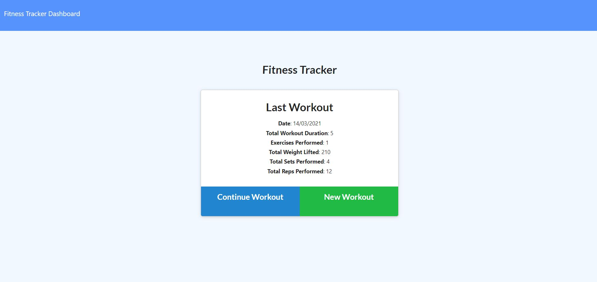
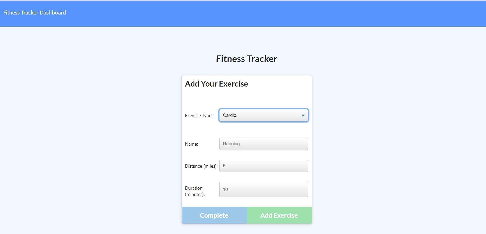
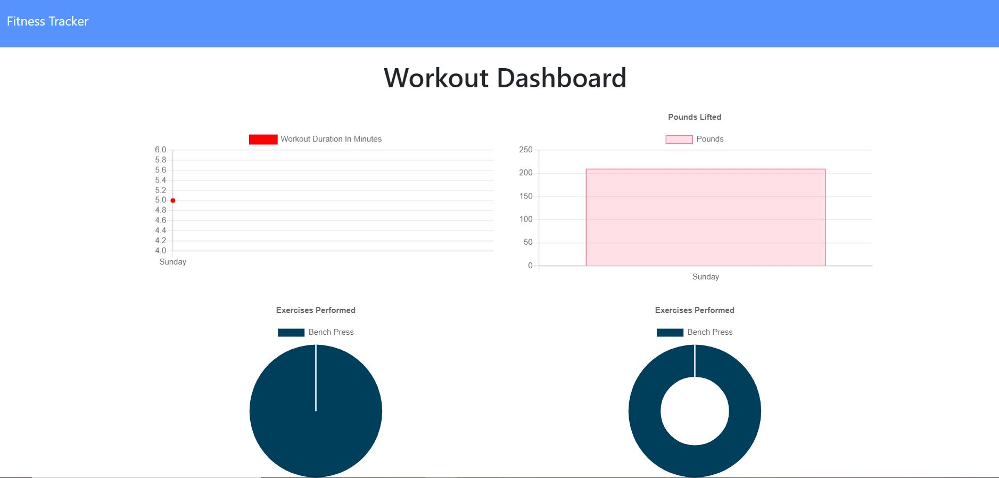

# Workout Tracker

### Overview

An application that allows the user to track their workouts whether it be resitance or cardio. When the user loads the page, they are given the option to create a new workout or continue with their last workout. The user can then either add exercises to the most recent workout plan and add exercises to a new workout plan. When the user loads the page they will also be able to view the total duration of each workout from the past seven workouts. On the dashboard the user will be able to view the combined weight of multiple exercises from the past seven workouts illustrated by various graphs.

## User Story

As a user, I want to be able to view create and track daily workouts. I want to be able to log multiple exercises in a workout on a given day. I should also be able to track the name, type, weight, sets, reps, and duration of exercise. If the exercise is a cardio exercise, I should be able to track my distance traveled.

## Business Context

A consumer will reach their fitness goals more quickly when they track their workout progress.

### Application Screenshot

#

#

### The application is available at:

https://shrouded-earth-92964.herokuapp.com/